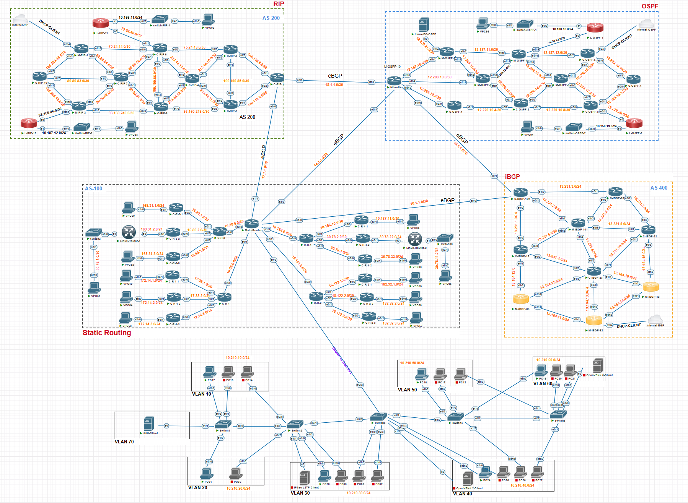

# Network Labs (PnetLab)
Учебный проект в эмуляторе PnetLab. Выполнен в рамках курса «Сети и системы передачи информации».  
Успешно защищено 6 лабораторных работ с использованием образов Cisco IOS и MikroTik.

*Итоговая топология всех 6 лабораторных работ*

## Лабораторные работы
| № | Тема |
|---|------|
| 1 | [VLAN (Access/Trunk), VTP, DHCP-сервер, Router-on-a-Stick](./lab-01-vlan-vtp-dhcp.pdf) |
| 2 | [Статическая маршрутизация](./lab-02-static-routing.pdf) |
| 3 | [Динамическая маршрутизация RIP и OSPF](./lab-03-rip-ospf.pdf) |
| 4 | [eBGP, iBGP с Route Reflector](./lab-04-ibgp-ebgp.pdf) |
| 5 | [SSH-доступ, настройка NAT (выход в Интернет)](./lab-05-ssh-nat.pdf) |
| 6 | [Access Control Lists — фильтрация трафика](./lab-06-acl-filtering.pdf) |

## Полученные навыки
### 1. Сегментирование сети (VLAN) и безопасное управление
- Создание 7 VLAN, настройка access и trunk-портов на 5 коммутаторах
- Протокол VTP v3 (Primary Server) для централизованного управления VLAN
- Защищённый протокол SSH на всех сетевых устройствах
  
### 2. DHCP, статическая маршрутизация и NAT
- Настройка DHCP-сервера с пулами для каждой VLAN
- Статическая маршрутизация между подсетями
- Технология NAT для выхода устройств в Интернет

### 3. Динамическая маршрутизация и BGP
- Протоколы RIP и OSPF для построения маршрутов между подсетями
- Внешний BGP (eBGP) между автономными системами
- Внутренний BGP (iBGP) с использованием Route Reflector

### 4. Контроль доступа (ACL)
- Access Control Lists для ограничения трафика между VLAN
- Изоляция отдельных подсетей (запрет доступа к чужим сетям)
- Фильтрация по протоколам (разрешён только ICMP, остальное запрещено)
